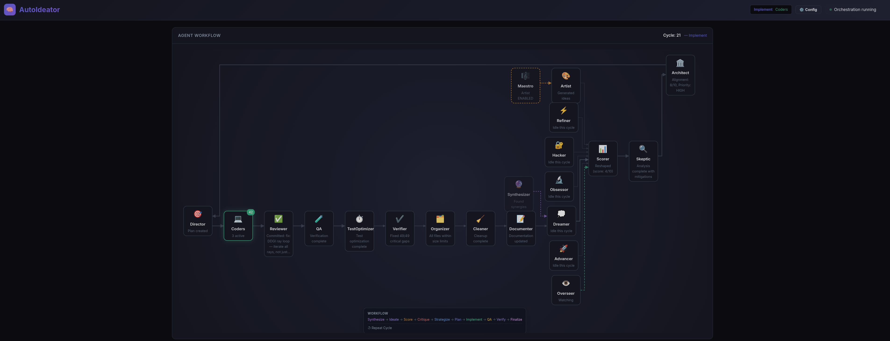

# AutoIdeator

A self-improving AI orchestration agent that takes a detailed description of your finished project — what *done* looks like, with no implementation steps or phasing — and works toward making it real through coordinated agent swarms with intelligent quality control, strategic planning, and systematic goal verification.



## Overview

AutoIdeator is an autonomous development system that:
1. Takes a **final goal** — a detailed, multi-sentence description of the intended end result. Describe what the finished project should look like, do, and feel like for the user. **Do not** prescribe implementation steps, phases, milestones, technologies, or task lists — the agents handle planning. The more clearly the desired end state is described, the better convergence will be.
2. Generates improvement ideas via a rotating ensemble of specialized idea agents
3. **Scores and filters ideas** for goal alignment and quality
4. **Critiques ideas constructively** with suggested mitigations
5. **Evaluates strategic alignment** and long-term planning
6. Makes implementation decisions balancing creativity and criticism
7. Implements the plan with parallel coders
8. Reviews, fixes, and commits changes
9. **Runs QA** (build + test verification)
10. **Optimizes slow tests** to keep the suite fast
11. **Verifies goal completion** with 3-step feature inventory, per-feature checks, and auto-remediation
12. **Refactors oversized files** into smaller modules (every other cycle)
13. **Cleans up** temp files and build artifacts
14. Updates project documentation
15. **Records outcomes for learning and deduplication**
16. **Periodically synthesizes synergies** across recent work
17. **Checkpoints state** for pause/resume across restarts
18. Repeats the cycle infinitely until stopped

Users can inject suggestions at any time via the Overseer agent, which takes priority over the autonomous idea generation pipeline.

## Web Dashboard

> **The web dashboard is the recommended way to run AutoIdeator and is the only entry point that has been tested end-to-end.** The headless CLI documented further down exists for scripting but has not been exercised in practice — prefer the dashboard unless you have a specific reason not to.

AutoIdeator includes a web dashboard for visualizing and controlling the multi-agent system:

```bash
# Start the web dashboard (recommended)
./gradlew runDashboard

# Alternative: build an installable distribution and launch via java
./gradlew installDist
java --enable-preview -cp 'build/install/autoideator/lib/*' com.autoideator.DashboardApplication
```

The single quotes around `'build/install/autoideator/lib/*'` are required so the `*` reaches the JVM literally — Java's classpath wildcard recognizer expands it to every jar in `lib/`. Without quoting, the shell would expand the glob first and the JVM would only see the first jar.

Then open http://localhost:7070 in your browser.

### Dashboard Features
- **Real-time Agent Graph**: Visualize the full agent pipeline including IdeaQueue rotation
- **Live Info Bar**: Current phase, active agent, and cycle timer
- **Overseer Panel**: Submit user suggestions that override the next idea generation cycle
- **Configuration Modal**: Live-edit LLM, orchestration, agent, git, and logging settings (tabbed UI)
- **System Metrics**: CPU, memory, and thread monitoring
- **Token Statistics**: Track token usage across all agents
- **Event Log**: Real-time activity feed via WebSocket
- **Agent Output Modal**: View full untruncated agent output (up to 500K chars per agent)
- **Control Panel**: Start/stop/pause/resume orchestration with custom goals and working directories
- **Checkpoint Status**: View and manage pause/resume checkpoints

### Dashboard API

| Method | Endpoint | Description |
|--------|----------|-------------|
| `GET` | `/api/status` | Running state, cycle count, total tokens, idea, working directory, `hasCheckpoint` |
| `GET` | `/api/stats` | System metrics (CPU, memory, threads) |
| `GET` | `/api/agents` | Agent states and recent activity |
| `GET` | `/api/config` | Full live configuration (nested JSON, camelCase keys) |
| `POST` | `/api/config` | Apply partial config updates (409 if running) |
| `GET` | `/api/overseer` | Overseer status: `{ pending, suggestion }` |
| `POST` | `/api/overseer` | Queue a user suggestion (400 if not running, 409 if already pending) |
| `GET` | `/api/agent-output?agent=NAME` | Full untruncated output for a specific agent |
| `GET` | `/api/agent-outputs` | Summary map of agent name to output char count |
| `GET` | `/api/agent-output-history` | History of agent outputs per cycle |
| `GET` | `/api/coder-output` | Coder execution output |
| `GET` | `/api/coder-output-history` | Coder output history across cycles |
| `GET` | `/api/retry-attempts` | Retry tracking for failed operations |
| `GET` | `/api/retry-summary` | Retry statistics summary |
| `GET` | `/api/checkpoint` | Checkpoint status (version, timestamp, cycle count) |
| `DELETE` | `/api/checkpoint` | Manually delete saved checkpoint |
| `POST` | `/api/start` | Start orchestration (409 if already running) |
| `POST` | `/api/stop` | Stop orchestration |
| `POST` | `/api/pause` | Pause running orchestration |
| `POST` | `/api/resume` | Resume paused orchestration |

WebSocket endpoint: `/ws` — receives real-time `AgentEvent` messages (STARTED, IN_PROGRESS, COMPLETED, FAILED, WAITING, THINKING, TOOL_USE, RETRY, PAUSED).

## Architecture

### Director Mode (Default)

Multi-agent collaboration system with 20+ specialized agents across 14 phases:

```
┌──────────────────────────────────────────────────────────────────────────────┐
│                          Director Orchestrator                               │
├──────────────────────────────────────────────────────────────────────────────┤
│                                                                              │
│  Phase 0 (every N cycles):  ┌──────────────────────┐                        │
│                              │  Synthesizer Agent    │                        │
│                              │  (merge complementary │                        │
│                              │   ideas from recent   │                        │
│                              │   cycles)             │                        │
│                              └──────────────────────┘                        │
│                                                                              │
│  Phase 1: Idea Generation                                                    │
│  ┌───────────┐   priority    ┌──────────────────────────────────────────┐    │
│  │  Overseer  │─────────────▶│     IdeaQueue (weighted round-robin)     │    │
│  │  (user     │  (if no user │  Dreamer → Artist → Refiner →            │    │
│  │  suggestion│   suggestion)│  Hacker → Obsessor → Advancer            │    │
│  │  pending)  │              │                                          │    │
│  └───────────┘              │  ┌─────────┐                              │    │
│                              │  │ Maestro │ gates Artist on/off          │    │
│                              │  └─────────┘                              │    │
│                              └──────────────────────────────────────────┘    │
│                                            │                                 │
│                                            ▼                                 │
│  Phase 2: Scoring            ┌──────────────────────┐                        │
│                              │   Scorer Agent        │                        │
│                              │   (goal alignment,    │                        │
│                              │    novelty,            │                        │
│                              │    feasibility)        │                        │
│                              └──────────────────────┘                        │
│                                            │                                 │
│                                            ▼                                 │
│  Phase 3: Critique           ┌──────────────────────┐                        │
│                              │   Skeptic Agent       │                        │
│                              │   (risks, mitigations,│                        │
│                              │    refined versions)   │                        │
│                              └──────────────────────┘                        │
│                                            │                                 │
│                                            ▼                                 │
│  Phase 4: Strategy           ┌──────────────────────┐                        │
│                              │   Architect Agent     │                        │
│                              │   (strategic alignment,│                       │
│                              │    phase-aware priority)│                      │
│                              └──────────────────────┘                        │
│                                            │                                 │
│                                            ▼                                 │
│  Phase 5: Decision           ┌──────────────────────┐                        │
│                              │   Director Agent      │                        │
│                              │   (plan & tasks)      │                        │
│                              └──────────────────────┘                        │
│                                            │                                 │
│                                            ▼                                 │
│  Phase 6: Implementation     ┌──────────────────────┐                        │
│                              │   Coders (parallel)   │                        │
│                              └──────────────────────┘                        │
│                                            │                                 │
│                                            ▼                                 │
│  Phase 7+8: Review & Commit  ┌──────────────────────┐                        │
│                              │   Reviewer Agent      │                        │
│                              └──────────────────────┘                        │
│                                            │                                 │
│                                            ▼                                 │
│  Phase 9: QA                 ┌──────────────────────┐                        │
│                              │   QA Agent            │                        │
│                              │   (build + test)      │                        │
│                              └──────────────────────┘                        │
│                                            │                                 │
│                                            ▼                                 │
│  Phase 9b: Test Optimization ┌──────────────────────┐                        │
│                              │   TestOptimizer Agent │                        │
│                              │   (slow test cleanup) │                        │
│                              └──────────────────────┘                        │
│                                            │                                 │
│                                            ▼                                 │
│  Phase 10: Goal Verification ┌──────────────────────┐                        │
│                              │   GoalVerifier Agent  │                        │
│                              │   10a: Inventory      │                        │
│                              │   10b: Per-feature    │                        │
│                              │   10c: Remediation    │                        │
│                              └──────────────────────┘                        │
│                                            │                                 │
│                                            ▼                                 │
│  Phase 10d (every other      ┌──────────────────────┐                        │
│  cycle):  File Organization  │   Organizer Agent     │                        │
│                              │   (refactor oversized │                        │
│                              │    files > 150K       │                        │
│                              │    tokens)            │                        │
│                              └──────────────────────┘                        │
│                                            │                                 │
│                                            ▼                                 │
│  Phase 11: Cleanup           ┌──────────────────────┐                        │
│                              │   Cleaner Agent       │                        │
│                              │   (temp files, build  │                        │
│                              │    artifacts)          │                        │
│                              └──────────────────────┘                        │
│                                            │                                 │
│                                            ▼                                 │
│  Phase 12: Documentation     ┌──────────────────────┐                        │
│                              │   Documenter Agent    │                        │
│                              └──────────────────────┘                        │
│                                            │                                 │
│                                            ▼                                 │
│  Phase 13: Outcome Recording + Checkpoint Save                               │
│                              ┌──────────────────────┐                        │
│                              │  Repeat Ad Infinitum  │                        │
│                              └──────────────────────┘                        │
│                                                                              │
└──────────────────────────────────────────────────────────────────────────────┘
```

#### Agent Roles

**Phase 1: Idea Queue Agents** (weighted round-robin with configurable weights)

| Agent | Role | Default Weight | Behavior |
|-------|------|:-:|----------|
| **Dreamer** | Idea Generator | 1 | Generates 3-5 ideas for **NEW capabilities** that don't yet exist |
| **Artist** | Visual/UX Designer | 2 | UI, accessibility, and design improvements (frontend only, gated by Maestro) |
| **Refiner** | Performance Engineer | 1 | Bottlenecks, caching opportunities, algorithmic improvements |
| **Hacker** | Security Researcher | 1 | Vulnerabilities, missing validation, insecure defaults (white-hat, can be disabled) |
| **Obsessor** | Correctness Zealot | 5 | Edge cases, half-implemented features, misleading documentation |
| **Advancer** | Feature Deepener | 5 | Deepens **existing** features with richer output, better defaults, more complete implementations |

**Core Pipeline Agents**

| Agent | Phase | Role |
|-------|:-----:|------|
| **Scorer** | 2 | Evaluates goal alignment (0-10), novelty, and feasibility; reshapes weak ideas rather than rejecting |
| **Skeptic** | 3 | Critiques for risks, provides mitigations and refined versions; only rejects fundamentally flawed ideas |
| **Architect** | 4 | Evaluates strategic alignment, dependencies, and priority based on project phase (Bootstrap/Early/Growth/Mature) |
| **Director** | 5 | Synthesizes idea + critique + strategy into concrete implementation plan with numbered tasks |
| **Coder** | 6 | Executes implementation tasks (multiple spawned in parallel, limited by `maxConcurrentCoders`) |
| **Reviewer** | 7+8 | Reviews all changes, fixes obvious issues, generates commit message, and commits to git |
| **QA** | 9 | Runs build and test suite to verify project compiles and tests pass |
| **TestOptimizer** | 9b | Identifies and optimizes or removes slow tests to keep the suite fast |
| **GoalVerifier** | 10 | 3-step verification: inventories features, checks each individually, spawns Coders to fix failures |
| **Organizer** | 10d | Refactors oversized source files (>500K chars / ~150K tokens) into smaller modules; runs every other cycle |
| **Cleaner** | 11 | Removes temp files, test output, and build garbage; never touches source code or config |
| **Documenter** | 12 | Updates README.md and project documentation after each cycle |
| **Synthesizer** | 0 | Periodically reviews recent cycles and proposes merged/synthesized ideas (every N cycles) |

**Special Agents**

| Agent | Role |
|-------|------|
| **Overseer** | Formalizes user suggestions into the idea pipeline (takes absolute priority over IdeaQueue) |
| **Maestro** | Evaluates whether the project has a frontend; enables or disables Artist each rotation |

#### Workflow Cycle

1. **Synthesis (Phase 0, every N cycles)**: Synthesizer reviews recent cycles and proposes merged ideas that combine complementary improvements from different agents.

2. **Idea Generation (Phase 1)**: If the user submitted a suggestion via the Overseer, it runs instead of the IdeaQueue. Otherwise, the IdeaQueue selects the next idea agent based on configurable weights (default: Dreamer=1, Artist=2, Refiner=1, Hacker=1, Obsessor=5, Advancer=5). When Artist's turn comes, the Maestro evaluates whether the project has a frontend — if not, Artist is skipped. Hacker can also be disabled via the `hacker-enabled` config option. **Deduplication check** prevents repeating similar ideas.

3. **Idea Scoring (Phase 2)**: Scorer evaluates the idea on goal alignment (0-10), novelty, and feasibility. Low-scoring ideas are reshaped into goal-aligned alternatives rather than outright rejected.

4. **Critique (Phase 3)**: Skeptic critically analyzes the idea for risks, weaknesses, and feasibility. **Provides mitigations** and a **refined version** of the idea when issues are fixable. Only rejects fundamentally flawed ideas. Skipped on cycle 1 if fewer than 2 git commits exist.

5. **Strategic Evaluation (Phase 4)**: Architect evaluates strategic alignment (0-10), dependencies, and priority based on current project phase (Bootstrap/Early/Growth/Mature).

6. **Decision (Phase 5)**: Director reviews ideas, critiques, and strategic input, then creates a concrete implementation plan aligned with the project goal. Includes a convergence check to reject ideas that don't advance the goal.

7. **Implementation (Phase 6)**: Director spawns parallel Coders to execute the plan (up to `maxConcurrentCoders`). The CyclePlanParser extracts actionable tasks from the Director's plan.

8. **Review & Commit (Phase 7+8)**: Reviewer examines all changes, fixes issues, generates a commit message, and commits.

9. **QA (Phase 9)**: QA agent runs the build and test suite to verify the project compiles and all tests pass.

10. **Test Optimization (Phase 9b)**: TestOptimizer identifies slow tests and optimizes or removes them to keep the test suite fast.

11. **Goal Verification (Phase 10)**: GoalVerifier runs a 3-step process:
    - **10a — Inventory**: Enumerates all project features into a numbered checklist
    - **10b — Per-feature check**: Each feature is individually verified in parallel (batched by `maxConcurrentCoders`)
    - **10c — Remediation**: All failed features become CRITICAL tasks; Coders are spawned in batches to fix them
    - Falls back to legacy single-pass VERIFY mode if inventory parsing fails

12. **File Organization (Phase 10d, every other cycle)**: Organizer scans for source files exceeding ~150K tokens (~500K characters) and refactors them into smaller, cohesive modules. Only runs when oversized files are detected.

13. **Cleanup (Phase 11)**: Cleaner removes temporary files, test output, and build artifacts. Never touches source code, configuration, or tracked files.

14. **Documentation (Phase 12)**: Documenter updates project documentation to reflect the latest changes.

15. **Outcome Recording (Phase 13)**: Cycle outcome (idea quality, implementation success, review issues) is recorded for learning and future deduplication. Checkpoint is saved for pause/resume.

16. **Repeat**: Cycle continues infinitely until stopped.

### Classic Mode

Original planner-coder-reviewer workflow with iterative plan refinement. Uses PlannerAgent, CoderAgent, ReviewerAgent, TesterAgent, and GitAgent in a simpler pipeline.

## Features

- **Web Dashboard**: Real-time visualization with agent graph, metrics, Overseer panel, full agent output viewer, and live configuration editor
- **20+ Agent Collaboration**: Specialized agents for ideas, quality control, critique, strategy, decisions, implementation, review, QA, test optimization, goal verification, cleanup, and documentation
- **Weighted Idea Ensemble**: Six idea agents (Dreamer, Artist, Refiner, Hacker, Obsessor, Advancer) rotate with configurable weights
- **Idea Quality Control**: Scorer reshapes ideas for goal alignment, novelty, and feasibility before implementation
- **Constructive Criticism**: Skeptic provides mitigations and refined ideas, not just problems
- **Strategic Planning**: Architect ensures long-term coherent progress with phase-aware prioritization
- **3-Step Goal Verification**: GoalVerifier inventories features, checks each individually, and auto-remediates failures
- **Test Optimization**: TestOptimizer keeps the test suite fast by identifying and fixing slow tests
- **File Organization**: Organizer refactors oversized files (>150K tokens) into smaller modules every other cycle
- **Automatic Cleanup**: Cleaner removes build garbage and temp files after each cycle
- **Idea Synthesis**: Periodically merges complementary ideas from different agents
- **Deduplication**: History tracking (100 cycles, 70% similarity threshold) prevents repeating similar ideas
- **Learning from Outcomes**: Records cycle outcomes to improve future decisions
- **Checkpoint/Resume**: Automatically saves state after each cycle; resumes from where it left off after restart
- **User Injection (Overseer)**: Submit suggestions via the dashboard that take priority over autonomous ideas
- **Maestro Gating**: Automatically enables/disables the Artist agent based on whether the project has a frontend
- **Configurable Hacker**: Security agent can be enabled/disabled via `hacker-enabled` config option
- **Parallel Execution**: Multiple Coders work simultaneously with semaphore-based concurrency control
- **Bubblewrap Sandbox**: Write isolation via `bwrap` — agents can only write to the project directory and `/tmp`
- **Auto-Review & Commit**: Reviewer ensures quality before each commit
- **Multi-LLM Support**: Claude CLI, Custom Claude CLI (with env var injection), OpenCode CLI, OpenRouter API
- **Live Configuration**: Edit LLM, orchestration, and agent settings at runtime via the dashboard
- **Virtual Threads**: High concurrency with Java 21 Project Loom
- **Immutable Data Models**: All configuration and model classes are Java records with wither methods

## Requirements

- Java 21+ (for virtual threads and modern features)
- Gradle 8.5+
- Git
- **Bubblewrap** (recommended) — for filesystem write isolation of agent processes
  - Arch/Manjaro: `pacman -S bubblewrap`
  - Debian/Ubuntu: `apt install bubblewrap`
  - Fedora: `dnf install bubblewrap`
  - If not installed, agents run without sandbox (warning logged at startup)
- One or more LLM backends:
  - Claude CLI (`claude` in PATH)
  - Custom Claude CLI (`claude` with injected env vars for alternative providers)
  - OpenCode CLI (`opencode` in PATH)
  - OpenRouter API key

## Quick Start

> **New here?** Read [docs/USAGE.md](docs/USAGE.md) first — it walks an empty machine all the way to a running cycle (prerequisites, picking and authenticating an LLM backend, dashboard tour with screenshot, common pitfalls). The rest of this section is the short form.

### Using the Web Dashboard (Recommended)

```bash
# Start the web dashboard
./gradlew runDashboard

# Open http://localhost:7070 in your browser
# In the "Idea / Goal" field, describe what the finished project should look
# like — features, behavior, outputs, user experience — in as much detail as
# you can. Do not include implementation steps or phases. Then set the
# working directory and click "Start".
```

### Using the CLI (untested)

> **Untested path.** The headless CLI compiles and the flag plumbing is correct, but only the dashboard above has been exercised end-to-end. Use the CLI at your own risk and prefer the dashboard for any real workload.

The `--idea` value is a **detailed description of the finished project** — what it does, how a user interacts with it, and what the output looks like. It is *not* a plan or a task list. Multi-sentence descriptions work best; the examples below keep things to a single line for shell readability, but real goals should be more detailed.

Tip: when invoking through Gradle, wrap the goal in single quotes so `gradle --args` keeps the whole sentence as one argument. Embedded newlines in the goal are not reliable through `--args` — for multi-paragraph goals use a config file or the dashboard.

```bash
# Clone and build
git clone https://github.com/akumaburn/AutoIdeator.git
cd AutoIdeator
./gradlew build

# Run in Director mode (default) — infinite improvement cycle
./gradlew run --args="--idea 'A REST API for task management with users, tasks, projects, and workspaces; JSON responses with a consistent error envelope; integration tests covering every endpoint.' --working-dir /path/to/project"

# Dry run — one cycle only, no implementation
./gradlew run --args="--idea 'A static site generator that turns a folder of Markdown into a styled HTML site with navigation, search, and an RSS feed.' --working-dir /path/to/project --dry-run"

# Classic mode (planner/coder/reviewer pipeline instead of the multi-agent director)
./gradlew run --args="--idea 'A static site generator (see above).' --working-dir /path/to/project --mode classic"

# Pin a specific LLM backend (defaults to opencode-cli)
./gradlew run --args="--idea '...' --working-dir /path/to/project --backend opencode-cli"

# Custom Claude CLI (alternative Anthropic-compatible provider; reads ANTHROPIC_* env vars)
./gradlew run --args="--idea '...' --working-dir /path/to/project --backend custom-claude-cli"

# OpenRouter — the OpenRouter backend itself is also untested; prefer the env var over --api-key
OPENROUTER_API_KEY=your-key ./gradlew run --args="--idea '...' --working-dir /path/to/project --backend openrouter"
```

After `./gradlew installDist`, the same CLI is available as a generated launcher script that already passes `--enable-preview`:

```bash
./build/install/autoideator/bin/autoideator --idea '...' --working-dir /path/to/project
```

## Configuration

Copy `src/main/resources/application.conf.example` to `application.conf` and edit:

```hocon
autoideator {
  llm {
    # claude-cli, custom-claude-cli, opencode-cli, openrouter, mock
    backend = "opencode-cli"
    model = "glm-5"

    openrouter {
      api-key = ${?OPENROUTER_API_KEY}
      model = "anthropic/claude-3.5-sonnet"
    }

    custom-claude-cli {
      path = "claude"
      api-key = ${?ANTHROPIC_API_KEY}
      base-url = "https://api.z.ai/api/anthropic"
      model = "glm-5"
      # Disables the Claude CLI's permission prompts. Off by default — only
      # enable this inside the bubblewrap sandbox or a throwaway environment.
      dangerously-skip-permissions = false
    }
  }

  orchestration {
    plan-refinement-cycles = 12   # Classic mode only
    max-concurrent-agents = 10
    max-concurrent-coders = 5
    commit-interval = 5           # minutes
    hacker-enabled = true         # Enable/disable security agent
    sandbox-enabled = true        # bwrap write isolation (see Sandbox section)
    synthesize-interval = 5       # Run Synthesizer every N cycles

    idea-queue-weights {          # Configurable weights for idea agents
      dreamer  = 1
      artist   = 2
      refiner  = 1
      hacker   = 1
      obsessor = 5
      advancer = 5
    }
  }

  git {
    auto-commit = true
  }
}
```

## Sandbox (Write Isolation)

AutoIdeator uses [bubblewrap](https://github.com/containers/bubblewrap) (`bwrap`) to sandbox all agent-spawned processes. When enabled (the default), every LLM CLI invocation and git command runs inside a sandbox that:

- Mounts the entire host filesystem **read-only**
- Grants **write access only** to the project working directory and `/tmp`
- Provides `/dev`, `/proc`, and network access
- Terminates sandbox children when the parent Java process exits

This prevents agents and their tool subprocesses from accidentally (or maliciously) modifying files outside the project scope.

```
bwrap \
  --ro-bind / /                  # Entire filesystem read-only
  --dev /dev \
  --proc /proc \
  --tmpfs /tmp \                 # Ephemeral writable /tmp
  --bind "$WORKDIR" "$WORKDIR" \ # Writable project directory
  --bind "$TOOL_DATA" "$TOOL_DATA" \ # Writable CLI data dir (see below)
  --share-net \
  --die-with-parent \
  --new-session \
  -- <agent-command> <args...>
```

Each CLI backend automatically bind-mounts its own data directory as writable:

| Backend | Additional writable path | Purpose |
|---------|-------------------------|---------|
| OpenCode CLI | `~/.local/share/opencode/` | Database, logs |
| Claude CLI | `~/.claude/` | Session state, logs |
| Custom Claude CLI | `~/.claude/` | Session state, logs |
| Git | *(none)* | Writes only to the project directory |

In addition, the sandbox auto-detects and bind-mounts user-level build-tool caches as writable when present (required for Gradle/Maven/npm/etc. to work inside the sandbox): `~/.gradle`, `~/.m2`, `~/.npm`, `~/.cargo`, `~/.cache`, `~/.local/share/gradle`, `~/.sdkman`. Missing directories are silently skipped.

**Configuration:**

| Setting | Default | Description |
|---------|---------|-------------|
| `orchestration.sandbox-enabled` | `true` | Enable/disable bwrap sandboxing |

If `bwrap` is not installed, a warning is logged at startup and processes run unsandboxed. Availability checks (`--version` probes) always run unsandboxed since they don't modify files.

## Checkpoint / Resume

AutoIdeator automatically saves orchestration state after each completed cycle to `~/.autoideator/checkpoints/`. When the dashboard is restarted, it detects existing checkpoints and resumes from where it left off.

**Saved state includes:** cycle count, total tokens, consecutive errors, project phase, project type, synthesis insights, pending overseer suggestions, idea queue position and weights, full cycle history, and cycle outcomes.

| Behavior | What happens |
|----------|-------------|
| **Program exit** (Ctrl+C, crash) | Checkpoint preserved — treated as a pause |
| **Explicit Stop** (dashboard button) | Checkpoint deleted — fresh start on next run |
| **Start with checkpoint** | Restores full state, repopulates event broadcaster |
| **Manual delete** | `DELETE /api/checkpoint` clears saved state |

## LLM Backends

| Backend | Config key | Status | Description |
|---------|-----------|--------|-------------|
| **OpenCode CLI** | `opencode-cli` | Tested | Default. Streaming with stall detection, auto-retry (max 5, exponential backoff) |
| **Claude CLI** | `claude-cli` | Tested | Standard Claude CLI with prompt via stdin, configurable timeout (default 5 minutes) |
| **Custom Claude CLI** | `custom-claude-cli` | Tested | Claude CLI with env var injection (`ANTHROPIC_API_KEY`, `ANTHROPIC_BASE_URL`, `ANTHROPIC_MODEL`, etc.) for alternative providers |
| **OpenRouter** | `openrouter` | **Not tested** | HTTP API via OkHttp with Bearer token auth |
| **Mock** | `mock` | — | Canned responses for testing/development |

All backends support streaming via `sendPrompt(..., onChunk)`, implement `isAvailable()` health checks (10-second timeout), and use virtual thread executors for concurrent requests.

> **Caveat:** OpenCode CLI and Claude CLI (including the Custom Claude CLI variant) have been exercised end-to-end against real workloads and are the recommended backends. The OpenRouter backend is implemented but has **not** been tested in practice — expect rough edges, missing error-handling for provider-specific quirks, and possible adjustments needed before it is production-ready. Bug reports and patches are welcome.

## Project Structure

```
src/main/java/com/autoideator/
├── AutoIdeatorApplication.java       # CLI entry point
├── DashboardApplication.java         # Web dashboard entry point
├── ProcessManager.java               # Subprocess lifecycle management
├── config/
│   ├── AutoIdeatorConfig.java        # Immutable config records hierarchy
│   └── ConfigLoader.java             # HOCON config loader (Typesafe Config)
├── orchestrator/
│   ├── DirectorOrchestrator.java     # Multi-agent orchestration (Director mode)
│   ├── Orchestrator.java             # Classic orchestration
│   ├── PlanRefiner.java              # Iterative plan refinement
│   ├── ExecutionEngine.java          # Plan execution
│   ├── CyclePlanParser.java          # Parse Director plans into tasks
│   └── PhaseDetector.java            # Detect project phase and type
├── agent/
│   ├── Agent.java                    # Base interface + ExecutionContext + BaseAgent
│   ├── AgentSwarm.java               # Multi-agent coordinator (Classic mode)
│   ├── IdeaQueue.java                # Weighted round-robin idea agent scheduler
│   ├── DreamerAgent.java             # Creative idea generator (new capabilities)
│   ├── ArtistAgent.java              # Visual/UX improvement suggester
│   ├── RefinerAgent.java             # Performance optimizer
│   ├── HackerAgent.java              # Security vulnerability finder (white-hat)
│   ├── ObsessorAgent.java            # Correctness gap finder
│   ├── AdvancerAgent.java            # Feature deepener (existing features only)
│   ├── MaestroAgent.java             # Artist eligibility gate
│   ├── OverseerAgent.java            # User suggestion formalizer
│   ├── ScorerAgent.java              # Idea quality evaluator
│   ├── SkepticAgent.java             # Constructive critical analyst
│   ├── ArchitectAgent.java           # Strategic planning and alignment
│   ├── DirectorAgent.java            # Decision maker and plan creator
│   ├── CoderAgent.java               # Implementation specialist
│   ├── ReviewerAgent.java            # Code reviewer and committer
│   ├── QAAgent.java                  # Build and test verification
│   ├── TestOptimizerAgent.java       # Slow test identification and optimization
│   ├── GoalVerifierAgent.java        # 3-step feature verification and remediation
│   ├── OrganizerAgent.java           # Refactors oversized source files into smaller modules
│   ├── CleanerAgent.java             # Temp file and build artifact cleanup
│   ├── DocumenterAgent.java          # Documentation updater
│   ├── SynthesizerAgent.java         # Idea merger and synergy finder
│   ├── PlannerAgent.java             # Plan creator (Classic mode)
│   ├── TesterAgent.java              # Test runner (Classic mode)
│   └── GitAgent.java                 # Git operations (Classic mode)
├── llm/
│   ├── LlmInterface.java            # Abstract interface + factory method
│   ├── ClaudeCliClient.java          # Claude CLI (prompt via stdin)
│   ├── CustomClaudeCliClient.java    # Claude CLI with env var injection
│   ├── OpenCodeCliClient.java        # OpenCode CLI (prompt via stdin)
│   ├── OpenRouterClient.java         # OpenRouter HTTP API
│   ├── MockLlmClient.java           # Mock for testing
│   ├── ClaudeStreamParser.java       # Claude streaming output parser
│   └── CliProcessUtils.java         # Shared CLI process utilities
├── checkpoint/
│   ├── OrchestrationCheckpoint.java  # Immutable checkpoint record
│   └── CheckpointManager.java       # Save/load/delete checkpoint files
├── sandbox/
│   └── BubblewrapSandbox.java        # bwrap write-isolation wrapper
├── git/
│   └── GitOperations.java            # Git integration wrapper
├── model/
│   ├── Idea.java                     # Input idea (goal + working directory)
│   ├── Plan.java                     # Execution plan with task list
│   ├── Task.java                     # Task with types, status, and retries
│   ├── Result.java                   # Orchestration result
│   ├── AgentResponse.java            # LLM response wrapper
│   ├── ProjectPhase.java             # Project phase enum (Bootstrap/Early/Growth/Mature)
│   ├── IdeaScore.java                # Idea quality score (goal alignment, novelty, feasibility)
│   ├── CycleOutcome.java             # Cycle outcome with quality metrics
│   └── CycleHistoryManager.java      # History tracking, deduplication, and learning
├── web/
│   ├── DashboardServer.java          # Javalin web server + REST API
│   ├── EventBroadcaster.java         # WebSocket event broadcasting (singleton)
│   ├── AgentEvent.java               # Agent activity event record
│   └── SystemStats.java              # System metrics (CPU, memory, threads)
└── selfimprovement/
    ├── SelfImprovementEngine.java    # Finds and implements improvements
    └── EnhancementFinder.java        # Identifies improvement opportunities

src/main/resources/
├── application.conf.example          # HOCON configuration template
├── logback.xml                       # Logging configuration (console + rolling file)
└── web/index.html                    # Dashboard frontend (single-page app)

src/test/java/com/autoideator/
├── config/ConfigTest.java            # Config immutability and wither chaining
├── model/
│   ├── TaskTest.java                 # Task state transitions and retries
│   ├── PlanTest.java                 # Plan operations and progress
│   └── CycleHistoryManagerTest.java  # Deduplication and similarity checking
└── agent/
    ├── AgentSwarmTest.java           # Multi-agent execution
    └── IdeaQueueTest.java            # Weighted round-robin rotation tests
```

## CLI Options

### autoideator (CLI)

```
Usage: autoideator [options]
  --idea, -i <text>           Detailed description of the finished project
                              (what done looks like — features, behavior,
                              output, UX). Do not include implementation
                              steps or phases. (required)
  --working-dir, -w <path>    Working directory for the project (required)
  --mode, -M <type>           Orchestration mode: director (default) or classic
  --backend, -b <type>        LLM backend: claude-cli, custom-claude-cli, opencode-cli, openrouter
  --api-key <key>             API key for OpenRouter
  --model, -m <name>          Model to use
  --refinement-cycles, -r <n> Number of plan refinement cycles (classic mode only)
  --no-self-improve           Disable self-improvement cycle
  --dry-run                   Plan only, don't implement (one cycle in director mode)
  --config, -c <path>         Custom config file path
```

### autoideator-dashboard (Web)

```
Usage: autoideator-dashboard [options]
  --port, -p <port>           Port for the web server (default: 7070)
  --backend, -b <type>        LLM backend: claude-cli, custom-claude-cli, opencode-cli, openrouter
  --api-key <key>             API key for OpenRouter
  --model, -m <name>          Model to use
  --config, -c <path>         Custom config file path
```

## Stopping the Process

The process runs infinitely until stopped. Use:
- `Ctrl+C` to gracefully stop (checkpoint is preserved for resume)
- The shutdown hook will complete the current cycle before exiting
- Dashboard: click the **Stop** button (checkpoint is deleted for a fresh start)

## License

MIT License
